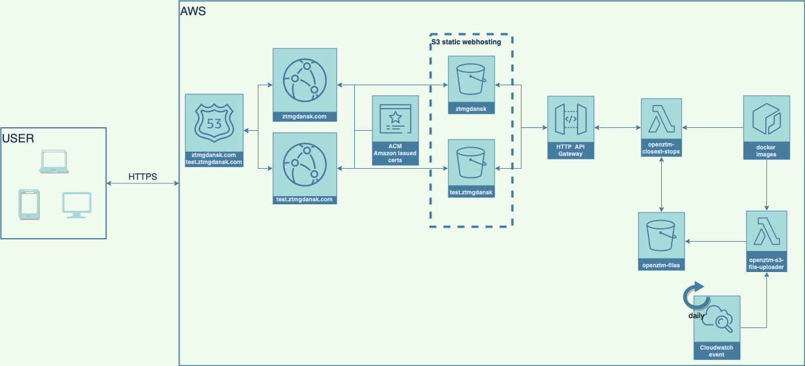

# Introduction
This is a rewrite of my previous project called `OpenZtmGdansk`. The older version used react class components and backend in spring boot to make calls. This approach is using the most recent approach in react - hooks with redux-toolkit. The app does not have backend, i.e. external API calls are made from the client side (with parsing the response).

## Architecture diagram


# Getting started
This project was bootstrapped with [Create React App](https://github.com/facebook/create-react-app), using the [Redux](https://redux.js.org/) and [Redux Toolkit](https://redux-toolkit.js.org/) template.
```bash
npx create-react-app openztm --template redux-typescript
```
## Available Scripts

In the project directory, you can run:

### `npm start`
Runs the app in the development mode.<br />
Open [http://localhost:3000](http://localhost:3000) to view it in the browser.

The page will reload if you make edits.<br />
You will also see any lint errors in the console.
### `npm test`
Launches the test runner in the interactive watch mode.<br />
See the section about [running tests](https://facebook.github.io/create-react-app/docs/running-tests) for more information.
### `npm run build`
Builds the app for production to the `build` folder.<br />
It correctly bundles React in production mode and optimizes the build for the best performance.

The build is minified and the filenames include the hashes.<br />
Your app is ready to be deployed!

See the section about [deployment](https://facebook.github.io/create-react-app/docs/deployment) for more information.

# Deployment
Build optimized content for S3 static website hosting
```bash
npm run build
```
Upload build artifacts to S3 and delete contents in the S3 bucket that are not present in the build dir
```bash
aws s3 sync ./build s3://<bucket-name>/ --delete
```

